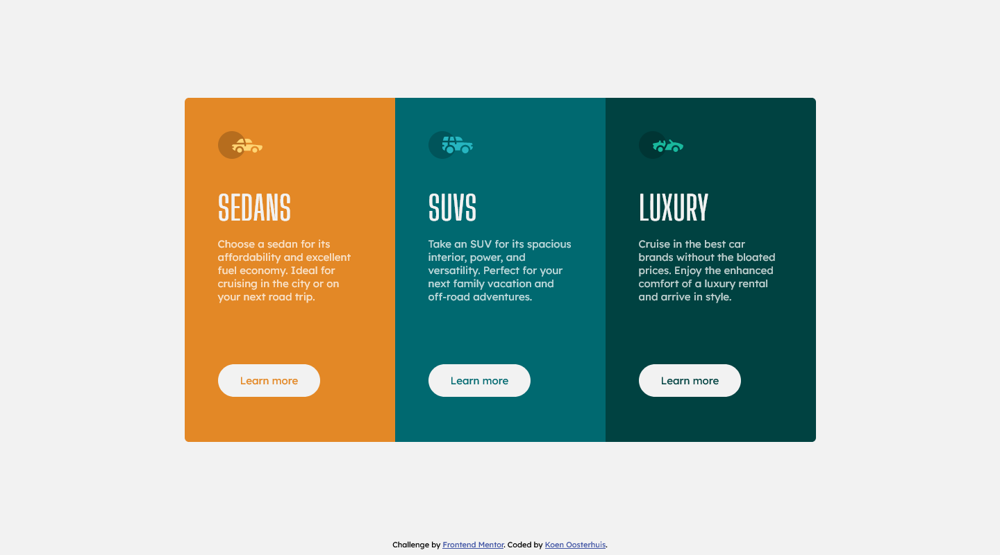
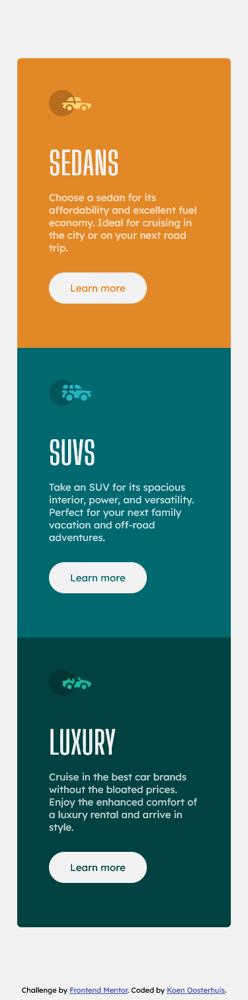

# Frontend Mentor - 3-column preview card component solution

This is a solution to the [3-column preview card component challenge on Frontend Mentor](https://www.frontendmentor.io/challenges/3column-preview-card-component-pH92eAR2-). Frontend Mentor challenges help you improve your coding skills by building realistic projects. 

## Table of contents

- [Overview](#overview)
  - [The challenge](#the-challenge)
  - [Screenshot](#screenshot)
  - [Links](#links)
- [My process](#my-process)
  - [Built with](#built-with)
  - [What I learned](#what-i-learned)
  - [Continued development](#continued-development)
- [Author](#author)

**Note: Delete this note and update the table of contents based on what sections you keep.**

## Overview

### The challenge

Users should be able to:

- View the optimal layout depending on their device's screen size
- See hover states for interactive elements

### Screenshot

### Links

- Solution URL: [Link](https://github.com/koeno100/3-column-preview-card)
- Live Site URL: [Link](https://koeno100.github.io/3-column-preview-card/)

## My process

### Built with

- Semantic HTML5 markup
- Flexbox
- Mobile-first workflow

### What I learned

This was a the first challenge which required me to change the orientation of the three boxes from column on mobile to row on desktop. It's a valuable technique to know, since there will probably be plenty of situations where I have to apply this to make content fit a mobile device.

Aside from that, I tried to do a mobile-first approach for this project. It makes sense, roughly half of the web visitors are on mobile users. Since a phone has a much smaller screen, it then seems logical to focus on making it work on mobile first, and then fix whatever needs to be fixed on desktop. It turns out, for this project, there is very little adjustment that had to be made!

I also found out a small thing, to use `flex-grow: 1` to push the footer all the way to the bottom of the page, instead of using `margin-top: auto` for both footer and main elements.

### Continued development

I would like to continue working on improving my skills when it comes to flexbox, although I also should start trying projects with grid and start implementing some JavaScript to my websites as well!

## Author

- Frontend Mentor - [@koeno100](https://www.frontendmentor.io/profile/koeno100)
